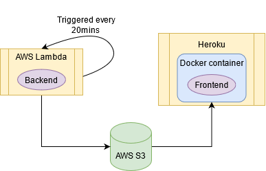

# Boulder gym tracker project



## Scraping

* [Scrapy](https://scrapy.org/)
* [PyOWM](https://github.com/csparpa/pyowm)
  * The environment variable `OWM_API` must be set

```bash
# play around a website with scrapy
scrapy shell https://www.website.com
# run crawler locally and save item into `output.json`
scrapy crawl boulder -o output.json
# If an external storage is defined (S3 from AWS for example):
scrapy crawl boulder
```

## Backend docker

Set AWS profile
```
export AWS_PROFILE=boulder
```

Or set the environment variables `AWS_ACCESS_KEY_ID`, `AWS_SECRET_ACCESS_KEY`.

To run backend Dockerfile in local: 

```bash
docker build -t boulder-backend -f Dockerfile.backend .
docker run -d boulder-backend 
docker exec -it CONTAINER_NAME /bin/bash
```

## Front-end

Run [Streamlit](https://streamlit.io/) locally

```bash
streamlit run app.py
```

## Deployment: [Heroku](https://devcenter.heroku.com/)

* [Create app in Heroku](https://dashboard.heroku.com) and set a name. In this case, **`bouldern`**
* Create `Dockerfile.web`
  * Add [specific streamlit commands](https://discuss.streamlit.io/t/how-to-use-streamlit-in-docker/1067/2), echo `$PORT` ([important](https://discuss.streamlit.io/t/deploying-heroku-error/1310/3)! The app might not recognize the port otherwise)
  * **Install dependencies before copying files**: see [Layer caching in this Medium post](https://blog.realkinetic.com/building-minimal-docker-containers-for-python-applications-37d0272c52f3)
* Create `Dockerfile.backend` with the backend clock function in CMD
* Set web and backend in `heroku.yml`

Set up project in Heroku

```bash
# attach project to heroku app
heroku git:remote -a bouldern
# log in with the CLI. docker must be running
heroku container:login
```

```bash
# push changes to heroku, --recursive so that it takes web & backend
heroku container:push --recursive
# release app
heroku container:release web backend
# upscale backend, it's off by default
heroku ps:scale backend=1
# check logs
heroku logs --tail
```

---------

## Resources

Legal info about scraping/crawling

1. [Web Scraping and Crawling Are Perfectly Legal, Right?](https://benbernardblog.com/web-scraping-and-crawling-are-perfectly-legal-right/)
2. [robots.txt file](https://www.boulderwelt-muenchen-ost.de/robots.txt) doesn't disallow scraping the main webpage.
3. No prohibitions in AGB or Datenschutzerklärung. No Nutzunsbedingungen

Estimation of circa 300 people for 59% of whole capacity (corona capacity).
